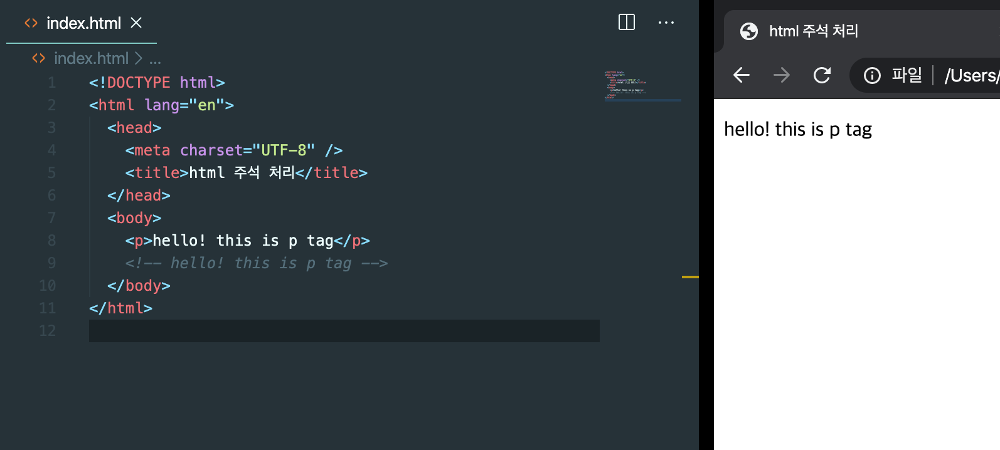

# HTML 의 주석

Html에 주석을 한 부분은 브라우저에게 보이지 않습니다. 즉 사용자는 볼수 없습니다. 하지만 개발자에게는 이전의 작업을 기억하기 위해서 유용합니다.

HTML의 주석 처리는 `<!--` 내용 `-->`입니다.

```html
<p>hello! this is p tag</p>
<!-- hello! this is p tag -->
```

결과:


